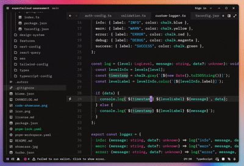

<div align="center">
  <h1>TaskFlow</h1>
  <p>An open-source task management app designed to simplify your workflow.</p>
</div>

## Introduction

TaskFlow is an open-source task management application designed to help individuals and teams organize their tasks, projects, and workflows efficiently. With a clean and intuitive interface, TaskFlow empowers users to focus on what matters most—getting things done.

  

## Key /div>Features

- Task creation and organization
- Task grouping
- Priority settings
- Customizable task views
- Secure and private data handling

## Tech Stack

<div align="start">
  
</div>

TaskFlow is built with a modern and robust tech stack:

- **Frontend**: Next.js, Tailwind CSS
- **Components library**: RadixUI
- **API**: Hono.js
- **rpc**: Hono RPC
- **Server State**: Tanstack React Query
- **UI State**: Zustand
- **Database**: Neon Serverless Postgres Database
- **ORM**: Prisma
- **Authentication**: NextAuth
- **Deployment**: Vercel

## Installation

To set up your own instance of TaskFlow, follow these steps:

1. Clone the repository:
   ```bash
   git clone https://github.com/your-username/TaskFlow
   cd TaskFlow
